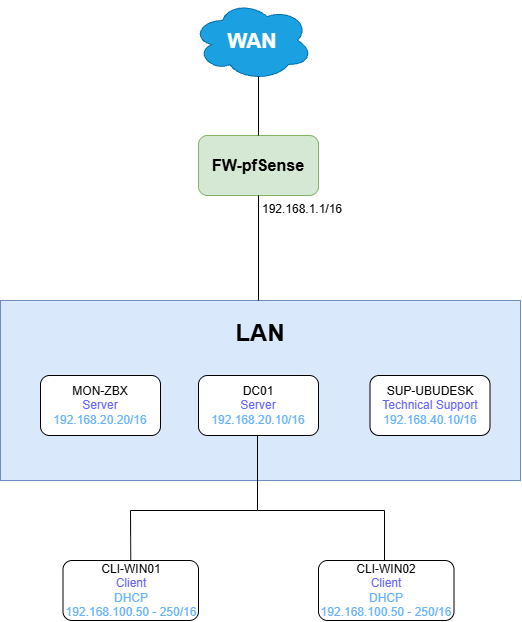

# Arquitectura

## Objetivo 
La infraestructura está diseñada para crear un laboratorio IT que permita simular un entorno empresarial.

El laboratorio permite trabajar con servicios de red, usuarios, equipos Windows, soporte técnico, actualizaciones y monitorización. También permite crear incidencias y probar diferentes soluciones sin afectar a un entorno real.


---

## Arquitectura general

La infraestructura está formada por un firewall, un servidor principal para los servicios de Windows, un servidor de monitorización, un equipo para soporte técnico y dos equipos cliente.


El firewall controla el tráfico de red y los equipos cliente utilizan los servicios proporcionados por el servidor de dominio.




## Componentes

1. **FW-pfSense**:
    - Sistema operativo: `pfSense 2.9.0`
    - Función: `firewall y control de la red del laboratorio`
    - Servicios principales:
        - Firewall
        - Segmentación de red
        - Control del tráfico entre redes.

*Se utiliza como punto de entrada y salida de la red. De esta forma, el tráfico entre el laboratorio e Internet queda controlado desde un único punto.*

2. **DC01**:
    - Sistema operativo: `Windows Server 2025`
    - Sistema operativo: `Windows Server 2025`
    - Función: `Servidor principal de la infraestructura Windows.`
    - Servicios principales:
        - Active Directory Domain Services (AD DS).
        - DNS
        - DHCP
        - Group Policy (GPO)
        - Organización mediante OUs.
        - Gestión de usuarios y grupos.
        - WSUS

*DC01 es el servidor principal del laboratorio. Se encarga de gestionar los usuarios y equipos del dominio, proporcionar direcciones IP, resolver nombres y aplicar las políticas de los equipos.*        

3. **MON-ZBX**:
    - Sistema operativo: `Ubuntu Server 26.04`
    - Función: `Proporcionar monitorización centralizada de la infraestructura.`
    - Servicios principales:
        - Zabbix 

*Zabbix permite comprobar el estado de los servidores y equipos, además de detectar posibles problemas mediante alertas.*

4. **SUP-UBUDESK**:
    - Sistema operativo: `Ubuntu Desktop 26.04`
    - Función: `Simulación de soporte técnico`
    - Servicios principales:
        - Ticketing.
        - Gestión de incidencias.

*Este equipo representa el puesto desde el que el equipo de soporte recibe y gestiona las incidencias de los usuarios.*

5. **CLI-WIN01**:
    - Sistema operativo: `Windows 11`
    - Función: `Simular un equipo cliente.`
    - Servicios principales:
        - Conexión al dominio
        - Aplicación de GPO
        - DHCP
        - DNS
        - Actualizaciones mediante WSUS
        - Simulaciones de incidencias.
6. **CLI-WIN02**:
    - Sistema operativo: `Windows 11`
    - Función: `Simular un equipo cliente.`
    - Servicios principales:
        - Conexión al dominio
        - Aplicación de GPO
        - DHCP
        - DNS
        - Actualizaciones mediante WSUS
        - Simulaciones de incidencias.

*Tener dos clientes permite probar diferentes configuraciones e incidencias y comprobar si un problema afecta a un solo equipo o a varios.*

## Flujo de red
El tráfico de los equipos cliente sigue un flujo controlado por los servicios de infraestructura y el firewall:
```
[CLIENTE]
    ↓
[Windows Server 2025]
    ↓
[Firewall - pfSense]
    ↓
[INTERNET / SERVICIO]
```
El acceso de los clientes a los servicios internos se realiza dentro de la red del laboratorio, mientras que el acceso hacia redes externas queda controlado por FW-pfSense.


## Decisiones del diseño
#### Firewall y segmentación
- **Decisión**: Utilizar pfSense como firewall principal.
- **Motivo**: Permite controlar fácilmente el tráfico de la red y preparar la infraestructura para futuras redes o segmentos.
- **Alternativas consideradas**:
    - Firewall de Windows.
    - Configuración directa de red.
    - OPNSense
- **Decisión final**: Utilizar pfSense porque facilita la gestión de la red desde un único punto.
#### Active Directory
- **Decisión**: Utilizar Active Directory para gestionar usuarios y equipos.
- **Motivo**: Permite tener los equipos y usuarios centralizados y aplicar políticas mediante GPO.
#### Monitorización
- **Decisión**: Utilizar Zabbix.
- **Motivo**: Permite comprobar desde un único sitio el estado de los equipos y servicios.
- **Alternativas consideradas**:
    - Revisiones manuales.
    - Otras herramientas de monitorización (Prometheus, Checkmk, Nagios Core)
- **Decisión final**: Utilizar Zabbix por su facilidad para añadir equipos, servicios y alertas.
#### Actualizaciones
- **Decisión**: Utilizar WSUS.
- **Motivo**: Permite controlar las actualizaciones de los equipos Windows desde el servidor.
- **Alternativas consideradas**:
    - GPO de actualizaciones
    - Windows Update directamente.
    - Actualizaciones manuales.
- **Decisión final**: Utilizar WSUS para poder probar la gestión de actualizaciones dentro del laboratorio.

## Limitaciones
Las siguientes características no forman parte de esta versión:
- DMZ
- Alta disponibilidad.
- Servidores redundantes.
- Sistema de copias de seguridad dedicado.
- SIEM.
-   Automatización avanzada.

Estas características podrán evaluarse en futuras versiones.

## Estado
**Estado**: `[En progreso]`
**Última actualización**: `01/09/2026`
