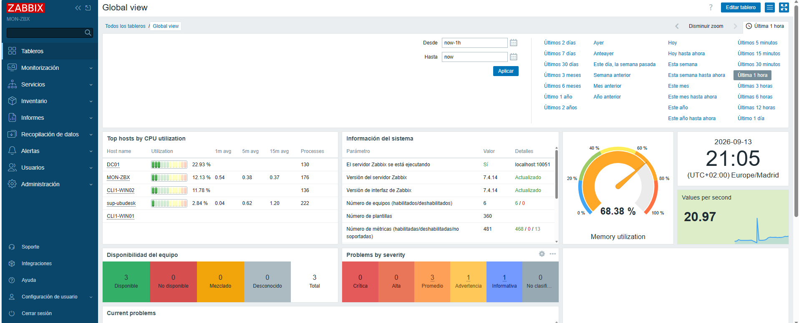
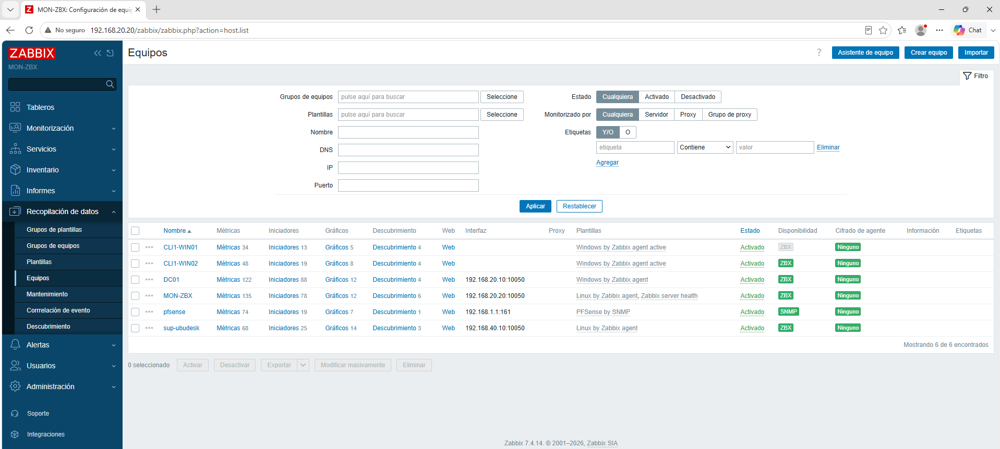
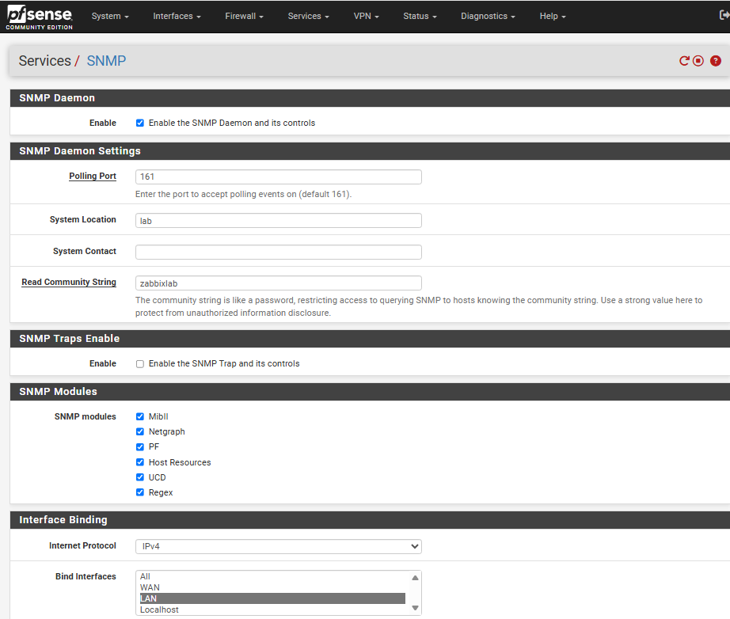
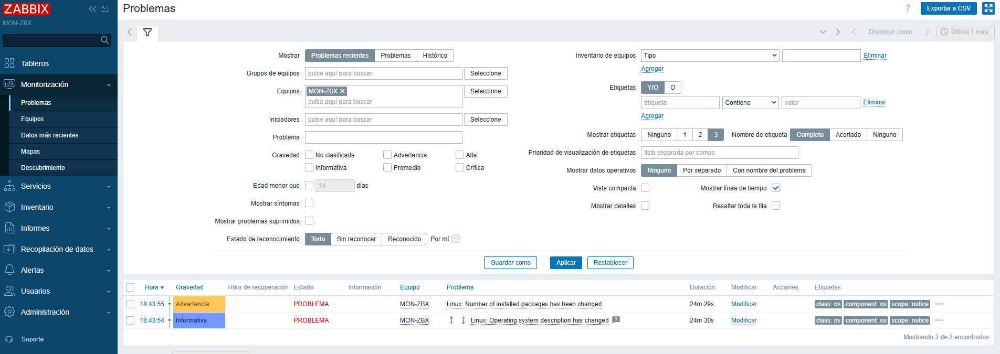

## Objetivo

Zabbix se utiliza para monitorizar la disponibilidad y el estado de los sistemas y dispositivos de red del laboratorio.

## Servidor de monitorización

| Propiedad | Valor |
| --- | --- |
| Hostname | `MON-ZBX` |
| Sistema | Ubuntu Server 26.04 |
| IP | `192.168.20.20/16` |
| Agente | Zabbix Agent 2 |

## Hosts monitorizados

| Host | Método | Métricas |
| --- | --- | --- |
| pfSense | SNMP | CPU, RAM, Disco, Uptime, Interfaces, Tráfico, Errores |
| Switch | SNMP | Interfaces, Tráfico, Errores, Disponibilidad |
| MON-ZBX | Agent 2 | CPU, RAM, Disco, Red, Procesos, Uptime |
| DC01 (Windows Server 2025) | Agent 2 | CPU, RAM, Disco, Red, Procesos, Servicios |
| CLI-WIN01, CLI-WIN02... | Agent 2 | CPU, RAM, Disco, Red, Procesos |
| Helpdesks (SUP-UBUDESK) | Agent 2 | CPU, RAM, Disco, Red, Procesos |


## Métricas

- **Disponibilidad:** Ping, Agent, SNMP y estado de interfaces.
- **CPU:** utilización y carga.
- **Memoria:** RAM utilizada y disponible.
- **Disco:** espacio utilizado y disponible.
- **Red:** tráfico, errores, paquetes y estado de interfaces.
- **Servicios:** estado de servicios críticos de Windows/Linux.

## Alertas

| Alerta | Condición | Severidad |
| --- | --- | --- |
| Disco alto | \> 80 % | Warning |
| Disco crítico | \> 90 % | High |
| CPU alta | \> 90 % | Warning |
| Memoria alta | \> 90 % | Warning |
| Host inaccesible | Sin respuesta durante 3 min | High |
| Interfaz caída | Estado DOWN | High |

## Flujo

```
Estado normal
    ↓
Problema detectado
    ↓
Alerta
    ↓
Investigación
    ↓
Resolución
    ↓
Recovery
```

## Capturas

Las principales capturas que se incluirán serán:

- Dashboard de Zabbix.



- Lista de hosts monitorizados.




- Configuración SNMP de pfSense.



- Alerta `PROBLEM`.


