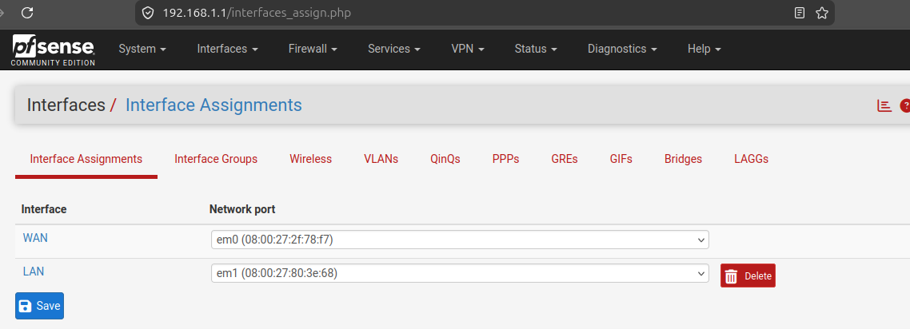
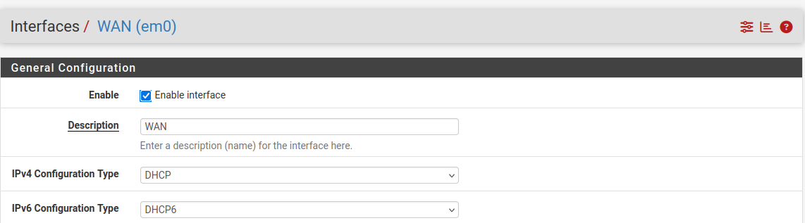
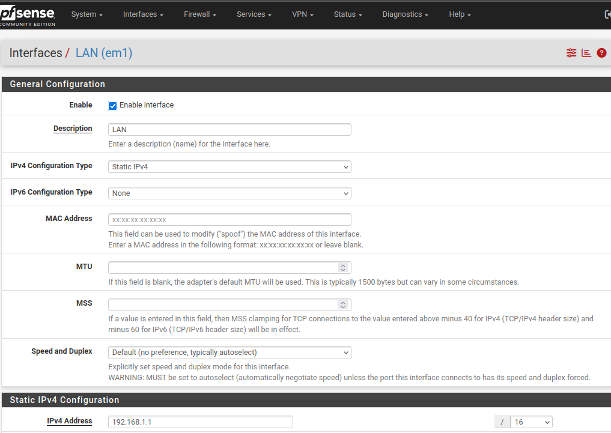
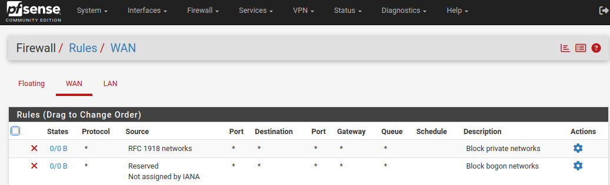
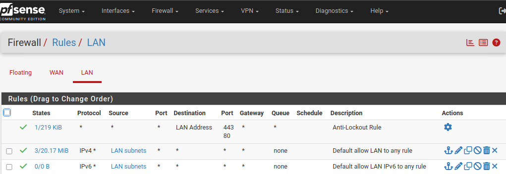
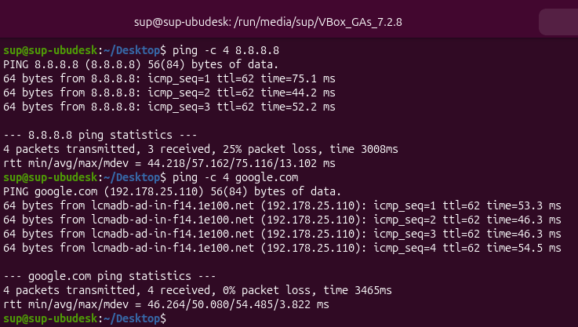

# pfSense

## Objetivo

pfSense actúa como:

- Gateway de la LAN.
- Firewall.
- Dispositivo NAT.
- Punto de salida a Internet.

---

## Interfaces

| Interfaz | IP | Función |
| -------- | -- | ------- |
| WAN | DHCP | Internet |
| LAN | 192.168.1.1/16 | Red interna |

- Interfaces

---

## Configuración WAN

**Tipo:** DHCP (10.0.2.0/24)
**Función:** Internet

--- 

## Configuración LAN

| Propiedad | Valor |
| --------- | ----- |
| Red | 192.168.0.0/16 |
| IP | 192.168.1.1 |
| Máscara | 255.255.0.0 |

---

## Reglas de firewall

| ID | Interface | Origen | Puerto Origen | Destino | Puerto Destino | Servicio | Acción | Motivo |
|---|---|---|---|---|---|---|---|---|
| FW-001 | WAN | * | * | * | * | IPv4 RFC1918 | Bloquear | Evitar tráfico con direcciones IP privadas entrando por WAN |
| FW-002 | WAN | * | * | * | * | IPv4 Bogons | Bloquear | Bloquear direcciones IP que no deberían aparecer en Internet |
| FW-003 | LAN | LAN net | * | * | * | IPv4 | Permitir | Permitir que los equipos de la LAN accedan a otros destinos |
| FW-004 | LAN | LAN net | * | * | * | IPv6 | Permitir | Permitir la salida de equipos LAN mediante IPv6 |
| FW-005 | LAN | LAN net | * | * | Firewall | * | Permitir | Evitar el bloqueo del acceso de administración al firewall desde la LAN |

- Reglas Firewall WAN

- Reglas Firewall LAN

---
## Pruebas realizadas

### Prueba 1 — Conectividad a Internet desde la LAN

**Objetivo:**  
Comprobar que los equipos de la red LAN pueden acceder a Internet a través de pfSense.

**Resultado esperado:**  
Los equipos de la LAN pueden acceder a sitios web externos y realizar conexiones a Internet.

**Resultado obtenido:**  
Los equipos de la LAN pueden acceder correctamente a Internet utilizando pfSense como gateway.

**Estado:**  
[Correcto]

### Prueba 2 — Resolución DNS desde la LAN

**Objetivo:**  
Comprobar que los equipos de la LAN pueden resolver nombres de dominio.

**Resultado esperado:**  
Los nombres de dominio se resuelven correctamente a direcciones IP.

**Resultado obtenido:**  
La resolución DNS funciona correctamente desde los equipos de la LAN.

**Estado:**  
[Correcto]

- Resultado de la prueba 1 y 2 desde SUP-UBUDESK

*Una vez creado y configurado las próximas máquinas, se planifica hacer pruebas con ellos*

---

## 9. Estado

**Estado actual:** [Activo]

**Última actualización:** [10/09/2026]