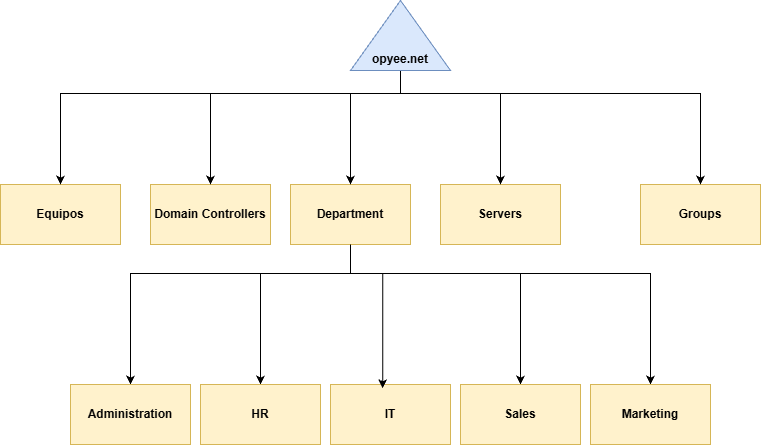
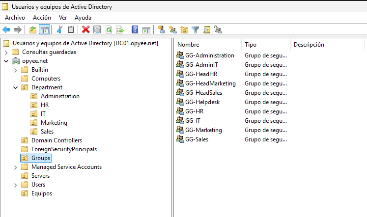

# Active Directory

## Objetivo

Active Directory se utiliza para centralizar:

- Usuarios
- Equipos
- Autenticación
- Grupos
- Políticas

---

## Dominio

**Nombre del dominio:**
```[OPYEE.NET]```
**Controlador del dominio:**
```[DC01]```

## Estructura de OUs



## Justificación

| OU | Propósito | Objetos almacenados |
| -- | --------- | ------------------- |
| Domain Controllers | El controlador de dominio | DC01 |
| Equipos | Equipos/dispositivos de la infraestructura | Pórtatiles / Ordenadores / Impresoras |
| Department | Separar diferentes departamentos de la empresa simulada | OUs de los departamentos |
| Servers | Servidores de la infraestructura | MON-ZBX |
| Groups | Almacenar grupos de la infraestructura | Grupos |
| Administration | Departamento de administración / dirección | - |
| HR | Departamento de recursos humanos | - |
| IT | Departamento de IT | - |
| Sales | Departamento de ventas | - |
| Marketing | Departamento de Marketing | - |


## Usuarios

| Usuario | Departamento | OU | Estado |
| ------- | ------------  | ------ | ---- |
| Clara Lopez | Administración | Administration | Active |
| Ronald Warold | Administración | Administration | Active |
| Lucy Rack | Recursos humanos | HR | Active |
| Sara Mina | Recursos humanos | HR Active |
| Finn Adyee | IT | IT | Active |
| Loren Sack | IT | IT | Active |
| Mino Rol | IT | IT | Active |
| Ruth Medjokovic | Ventas | Sales | Active |
| Ryu Sakamoto | Ventas | Sales | Active |
| Long Mei | Marketing | Marketing | Active |
| Lina Kay | Marketing | Marketing | Active |


## Grupos
| Grupo | Tipo | 
| ----- | ---- | 
| GG-Administration | Security |  
| GG-AdminIT | Security |
| GG-HeadHR | Security |
| GG-HeadMarketing | Security |
| GG-HeadSales | Security |
| GG-IT | Security |
| GG-HR | Security |
| GG-Marketing | Security |
| GG-Sales | Security |
| GG-Helpdesk | Security |


## Principios utilizados 
- Mínimo privilegio
- Administración mediante grupos
- Separación de cuentas administrativas

## Validación 
Pruebas realizadas con:
- Creación de usuario
- Inicio de sesión
- Pertenencia a grupos
- Aplicación de permisos




### Estado
[Activo]