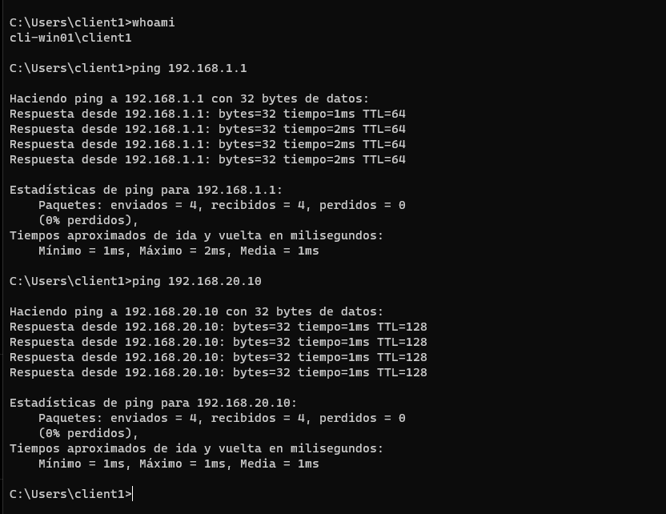
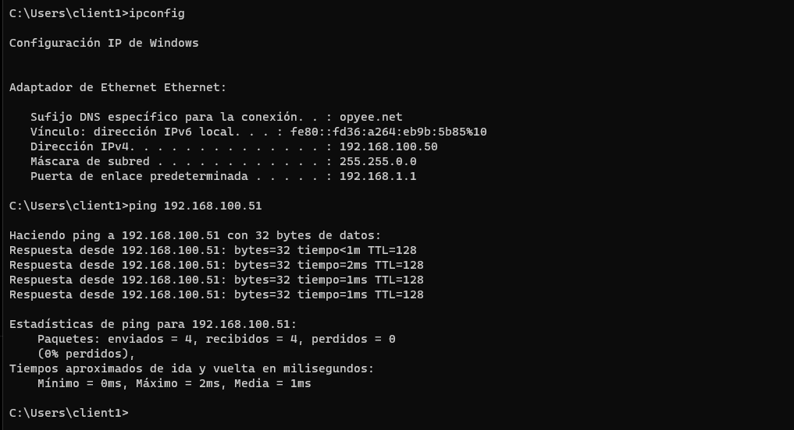
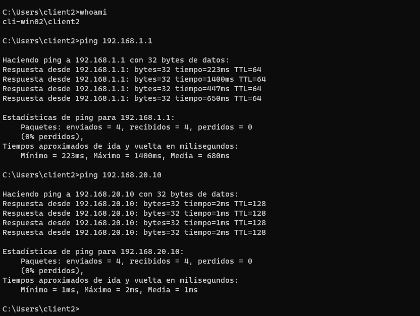
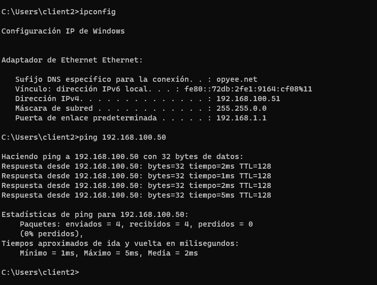
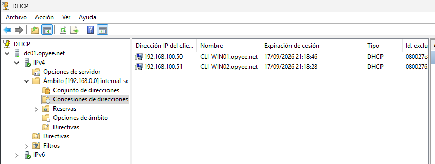
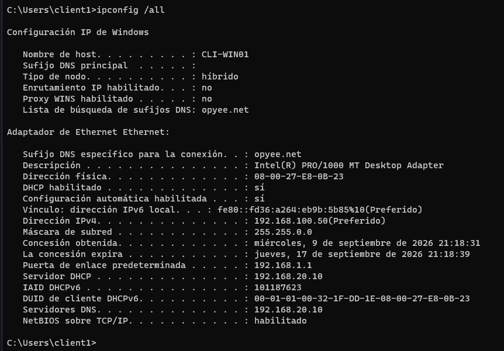
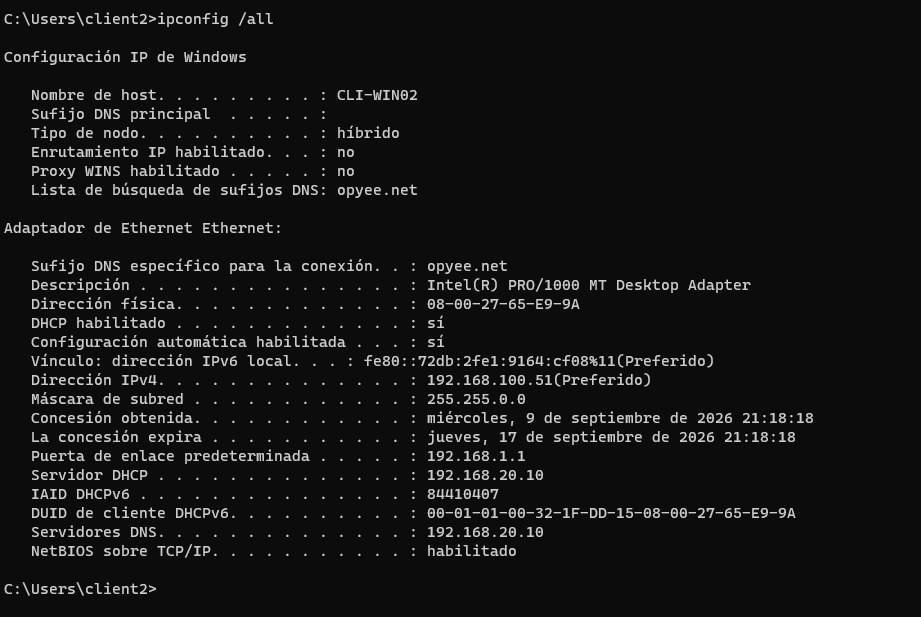

# DHCP

## Objetivo

El servidor DHCP proporciona automáticamente:

- Dirección IP.
- Máscara.
- Gateway.
- DNS.
- Información del dominio.

---

## Scope

| Propiedad | Valor |
|---|---|
| Nombre | internal-scope |
| Inicio | 192.168.100.50 |
| Fin | 192.168.100.250 |

---

## Opciones DHCP

| Opción | Valor |
|---|---|
| Router | 192.168.1.1 |
| DNS | 192.168.20.10 |
| Dominio | opyee.net |

---

## Prueba de funcionamiento

Cliente utilizado:

- **CLI-WIN01**:

- **CLI-WIN02**:

- **DC01**:

---

## Validación

-  Cliente obtiene IP.
-  Gateway correcto.
-  DNS correcto.
-  Renovación DHCP correcta.

**CLI-WIN01**:

**CLI-WIN02**:

