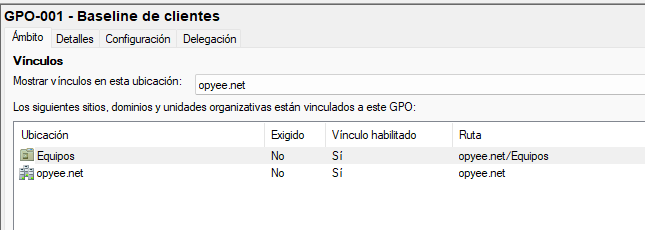
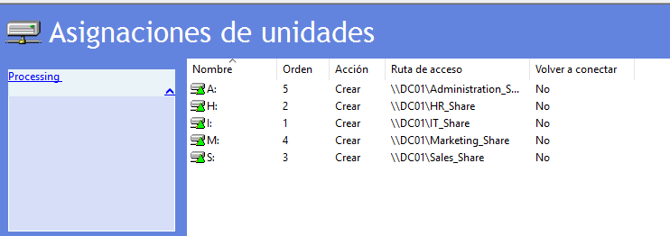
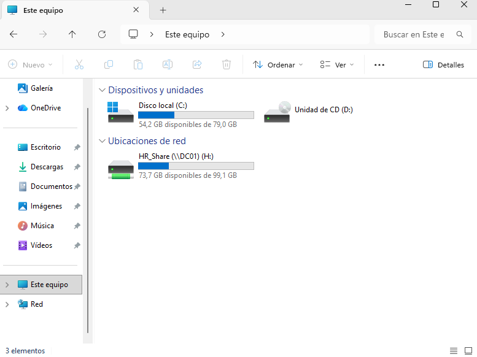
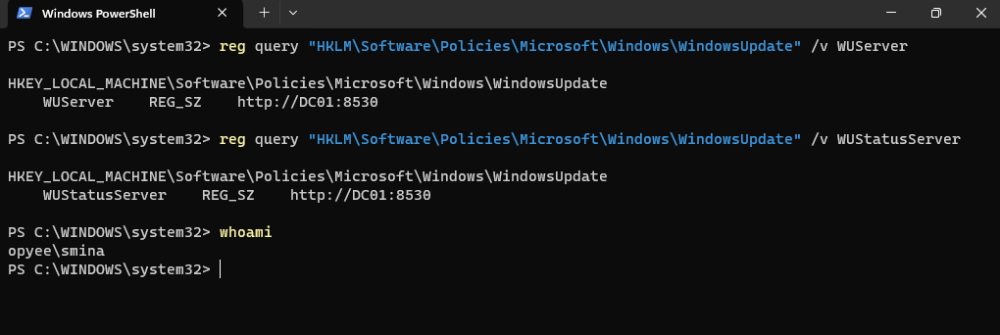

# Group Policy Objects

## Objetivo

Las GPO (Group Policy Objects) permiten aplicar configuraciones de forma centralizada a usuarios y equipos de un dominio de Active Directory.

---

## GPO-001 - Baseline de clientes

### Objetivo

Aplicar una configuración básica de seguridad a los equipos del dominio.

### Configuración

| Configuración | Valor |
| --- | --- |
| Bloqueo de pantalla | 15 min |
| Contraseña mínima | 8 caracteres |
| Complejidad | Activada |
| Caducidad contraseña | 90 días |
| Suspensión | 30 min |

### Aplicación

| Elemento | Valor |
| --- | --- |
| Enlace | `OU=Equipos,DC=OPYEE,DC=NET` |
| Security Filtering | `Authenticated Users` |
| Afecta a | Equipos de la OU |




 ### Validación

```
gpupdate /force
gpresult /r
```

**Estado:** En funcionamiento

---

## GPO-002 - Mapeo de unidades por departamento

### Objetivo

 Asignar configuraciones y unidades de red según el departamento del usuario.

### Configuración

| Departamento | Grupo | Unidad | Recurso |
| --- | --- | --- | --- |
| IT | `GG-IT` | I: | `\\DC01\\IT_Share` |
| HR | `GG-HR` | H: | `\\DC01\\HR_Share` |
| Sales | `GG-Sales` | S: | `\\DC01\\Sales_Share` |
| Marketing | `GG-Marketing` | M: | `\\DC01\\Marketing_Share` |
| Administration | `GG-Administration` | A: | `\\DC01\\Admin_Share` |



### Aplicación

| Elemento | Valor |
| --- | --- |
| Enlace | `OU=Department,DC=OPYEE,DC=NET` |
| Security Filtering | Grupos de departamentos |
| Afecta a | Usuarios |


### Validación

```
gpupdate /force
gpresult /r
```

**Resultado:** las unidades se asignan correctamente según el departamento.



**Estado:** En funcionamiento

---

## GPO-003 - Windows Update (WSUS)

### Objetivo

Configurar los equipos cliente para recibir actualizaciones desde el servidor **WSUS interno**.

### Configuración

| Política | Configuración |
| --- | --- |
| Actualizaciones automáticas | Habilitadas |
| Instalación | Automática, todos los días a las 03:00 |
| Servidor WSUS | `http://DC01:8530` |
| Servidor de estadísticas | `http://DC01:8530` |
| Reinicio con usuarios conectados | No forzado |

### Aplicación

| Elemento | Valor |
| --- | --- |
| Enlace | `OU=Computers,DC=OPYEE,DC=NET` |
| Security Filtering | `Authenticated Users` |
| Afecta a | Equipos |

 La GPO utiliza **Configuración del equipo**, por lo que afecta a los equipos y no directamente a los usuarios.

 ### Validación

```
gpupdate /force
gpresult /r
```

La GPO `GPO-003-Windows-Update` aparece correctamente en las políticas aplicadas.

Comprobación del servidor WSUS:

```
reg query "HKLM\Software\Policies\Microsoft\Windows\WindowsUpdate" /v WUServer
reg query "HKLM\Software\Policies\Microsoft\Windows\WindowsUpdate" /v WUStatusServer
```

**Resultado:**



Estado: Preparado para WSUS


---

## Resumen

| GPO | Objetivo | OU | Resultado |
| --- | --- | --- | --- |
| GPO-001-Baseline-Clientes | Seguridad base | `OU=Computers` | En funcionamiento |
| GPO-002-Mapeo de unidades por departamento | Configuración por departamento | `OU=Department` | En funcionamiento |
| GPO-003-Windows-Update | Preparar clientes para WSUS | `OU=Computers` | Preparado |


